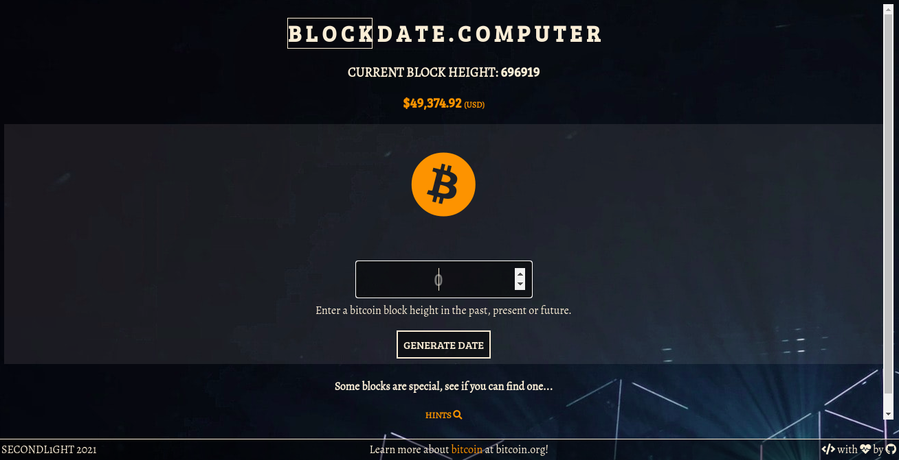

# BLOCKDATE.COMPUTER

A bitcoin block date calculator, enter a block height in the past, present or future and return a timestamp.

Link to site: <https://www.blockdate.computer>

## Table of Contents

-   [General Info](#general-information)
-   [Technologies Used](#technologies-used)
-   [Features](#features)
-   [Screenshots](#screenshots)
-   [Usage](#usage)
-   [Project Status](#project-status)
-   [Deployment Status](#deployment-status)
-   [Room for Improvement](#room-for-improvement)
-   [Acknowledgements](#acknowledgements)
-   [Contact](#contact)

## General Information

A web app utilizing JavaScript to create a single page experience with short loading times.

## Technologies Used

-   HTML
-   CSS
-   JavaScript

## Features

-   Enter a bitcoin block height to find out the time and date when it was mined.

## Screenshots

## Usage

Enter a block height into the input field and click on the 'generate date' button.

## Project Status

Project is: _in progress_

The web app is live but I will continue to make improvements in the future.

## Deployment Status

Deployed

## Room for Improvement

-   Add more easter eggs.
-   Add enter key functionality for searches.
-   Use my own node for some API data.

## Acknowledgements

-   Fonts by Google Fonts
-   Icons by (<https://www.fontawesome.com>)
-   Coded using Atom text editor
-   Special thanks to <https://github.com/alejandro> for reviewing my code and helping me refactor parts of it, also helping with debugging and overall being awesome!
-   API data provided by blockcypher.com, mempool.space and coindesk.com
-   Easter eggs created with help from https://github.com/janoside/btc-rpc-explorer
-   Background image Photo by <a href="https://unsplash.com/@fabioha?utm_source=unsplash&utm_medium=referral&utm_content=creditCopyText">fabio</a> on <a href="https://unsplash.com/s/photos/bitcoin?utm_source=unsplash&utm_medium=referral&utm_content=creditCopyText">Unsplash</a>

## Contact

If you would like to contact me please send me a message on Discord @secondl1ght#9164 or by e-mail at secondl1ght@protonmail.com, I would love to hear from you!

Personal portfolio website: <https://www.secondl1ght.site>
